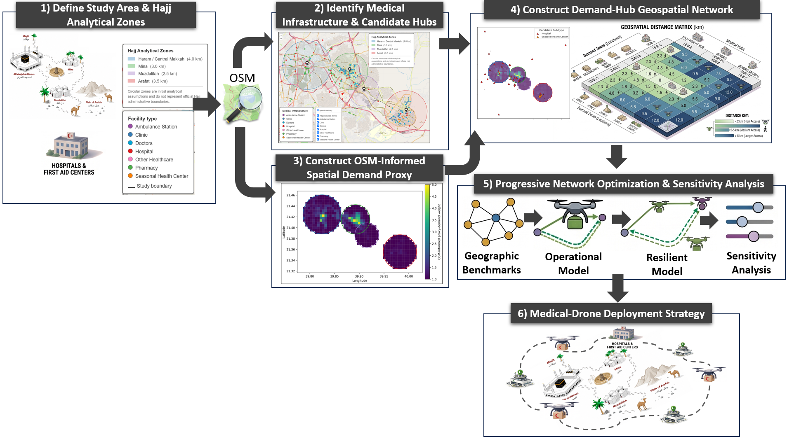

<div align="center">

# From Geographic Coverage to Operational Resilience

### Data-Driven Medical-Drone Hub Planning for Hajj

Official implementation

[](https://www.python.org/)
[](LICENSE)
[](DATA_LICENSE.md)
[](#citation)

</div>

---

## Graphical abstract

<p align="center">
  
</p>

---

## Summary

Severe crowding and road congestion during Hajj can delay urgent medical-supply
movement, and drone delivery has recently moved from a concept to an operational option
in the holy sites. Planning such a network is difficult because fine-grained demand data
are not publicly available.

This study builds a reproducible geospatial and optimization framework for drone-hub
planning under that data scarcity. Medical infrastructure extracted from OpenStreetMap
is combined with analytical Hajj zones, multi-resolution demand grids, an
activity-based demand proxy, candidate hubs drawn from existing medical facilities, and
a demand-to-hub air-distance matrix.

The same network is then analysed at three progressively stricter planning layers. Four
classical facility-location models establish a geographic benchmark. A mixed-integer
linear program then adds the operational requirements a real deployment faces: finite
drone fleets, return-to-origin missions, endurance, a response-time target, and
turnaround between flights. A final layer requires backup accessibility for
high-priority areas.

### Results

| Planning layer | Requirement added | Minimum network |
|---|---|:---:|
| **Geographic** | Complete coverage within 5 km | **3 hubs** |
| **Operational** | Fleet capacity, endurance, 5-min response, 30-min turnaround | **7 hubs, 19 drones** |
| **Resilient** | Two independently feasible hubs for high-priority cells | **10 hubs, 21 drones** |

Three findings follow:

- **Geographic coverage understates the hub requirement by more than threefold.** Three
  hubs can host at most nine drones, which supplies well under half the drone-minutes
  the workload needs, so the coverage-optimal network fails on throughput regardless of
  where those hubs are placed.
- **Ground time governs the design, not flight performance.** Turnaround accounts for
  most of the mission-cycle burden and is the widest-ranging sensitivity driver, while
  battery endurance is non-binding: varying the safe round trip from 10 to 20 km changes
  nothing, because the response-time target already imposes a tighter service radius.
- **Resilience is bought as spatial presence, not capacity.** Requiring backup coverage
  raises hubs by 42.9% but the fleet by only 10.5%, and two of the ten resilient hubs
  serve no packages at all.

---

## Repository structure

```
data/
  raw/osm/        OpenStreetMap extract the study is built from
  processed/      cleaned facilities, analytical zones, demand grids
  model/          optimization-ready matrices
    optimization_solutions/               geographic benchmark results
    operational_resilient_solutions_v4/   operational and resilient results
notebooks/        the analysis pipeline, in order
```

Inputs and saved results are both committed, so the notebooks can be read and inspected
without re-running the solver.

---

## Notebooks

Run in order. Each stage reads the previous stage's output from `data/`.

| # | Notebook | What it does | Output |
|:---:|---|---|---|
| 01 | `medical_infrastructure` | Extracts and cleans medical facilities from OpenStreetMap | 216 medical locations |
| 02 | `zones_and_validation` | Defines the four analytical Hajj zones and assigns facilities | zone geometries |
| 03 | `demand_grids_and_proxy` | Builds demand grids and the OSM activity proxy | grids of 2,192 / 556 / 142 cells |
| 04 | `candidate_hubs_and_distances` | Selects candidate hubs and computes air distances | 59 hubs, 556 × 59 matrix |
| 05 | `geographic_benchmarks` | Solves p-median, p-center, MCLP and LSCP | 108 runs |
| 07 | `operational_resilient_model` | Solves the operational-resilient MILP | 28 runs |

Notebooks **05** and **07** call the solver. The model is built with
[Pyomo](https://pyomo.org/) and solved with [HiGHS](https://highs.dev/). Notebook 07
decides which hubs are active, how many drones each holds, and how packages are
assigned, optimizing three objectives in order: fewest hubs, then smallest fleet, then
fastest response. Running either notebook overwrites the saved results in `data/model/`.

---

## Getting started

```bash
git clone https://github.com/Hindawi91/hajj-medical-drone-network.git
cd hajj-medical-drone-network
conda env create -f environment.yml
conda activate hajj-drone
jupyter lab
```

---

## Citation

If you use this code, please cite our paper:

```bibtex
@article{alhindawi2026hajj,
  title={From Geographic Coverage to Operational Resilience: Data-Driven
         Medical-Drone Hub Planning for Hajj},
  author={Al-Hindawi, Firas and Alhomaidhi, Esam},
  note={Manuscript in preparation},
  year={2026}
}
```

The paper is in preparation. This entry and [CITATION.cff](CITATION.cff) will be updated
once it is published.

---

## License

Code is released under the [MIT License](LICENSE). Data products derived from
OpenStreetMap are © OpenStreetMap contributors, available under the
[ODbL 1.0](DATA_LICENSE.md).

## Contact

**Firas Al-Hindawi** — <firas.hindawi@kfupm.edu.sa>
Industrial and Systems Engineering Department, King Fahd University of Petroleum and
Minerals, Dhahran, Saudi Arabia.
